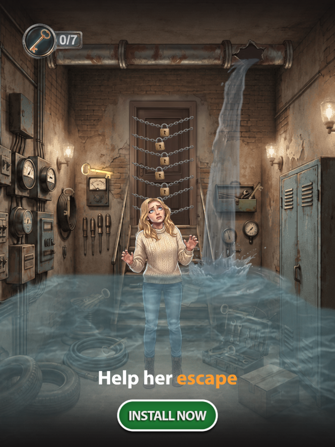
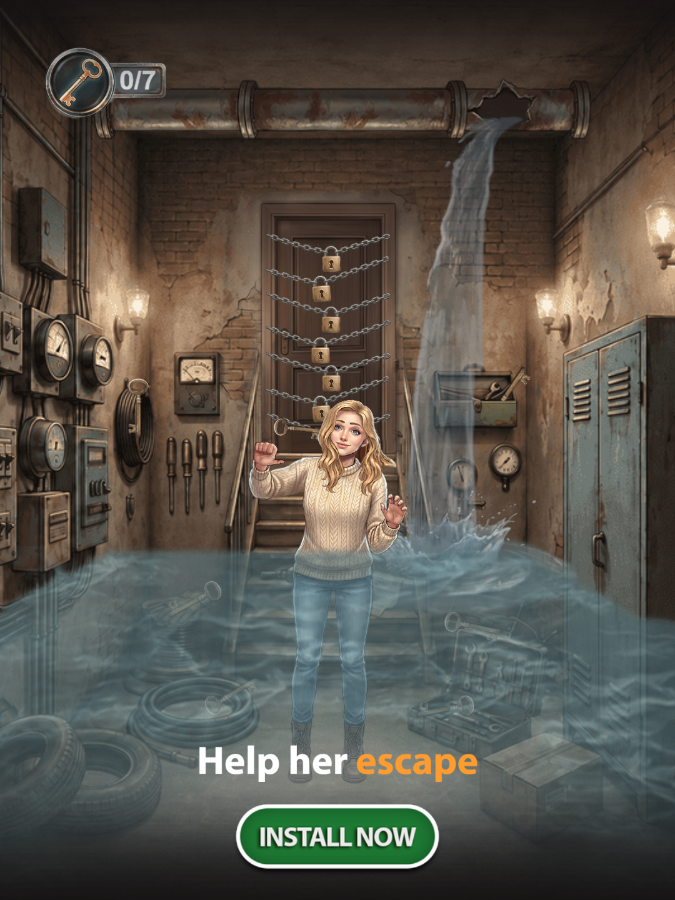
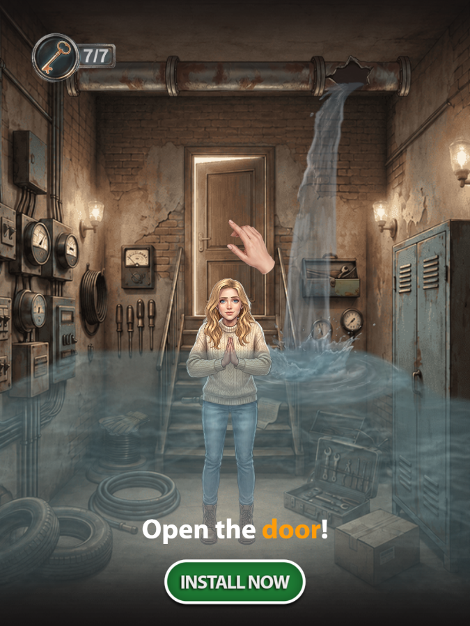
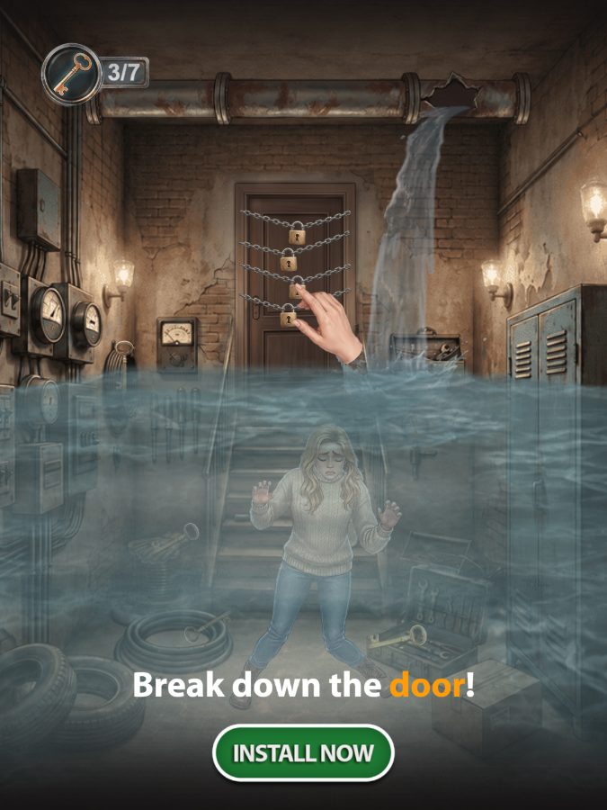

# MV_3_Search_Items

## Gallery

<table>
  <tr>
    <td></td>
    <td></td>
  </tr>
  <tr>
    <td></td>
    <td></td>
  </tr>
</table>

[Русская версия](README.ru.md)

This project was developed for a client through third parties.

The original project files are subject to a non-disclosure agreement (NDA) and cannot be published.

**[Play](https://mitfart.github.io/MV_3_Search_Items/)**
